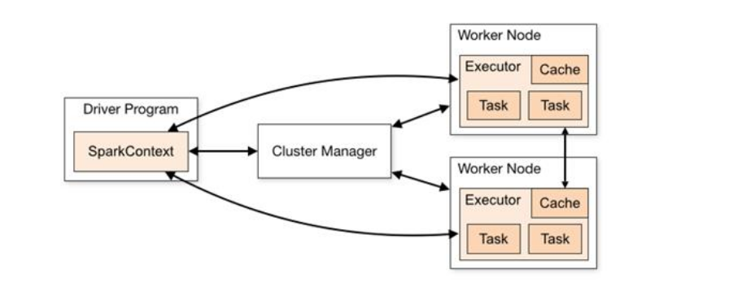
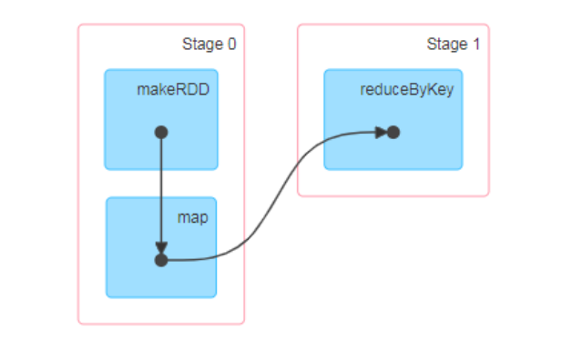
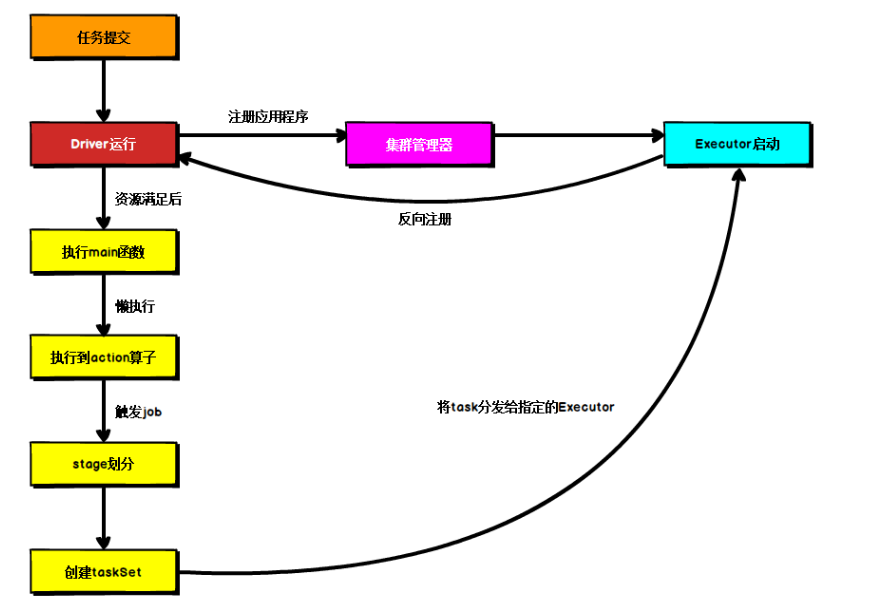

### Spark简介
Spark 是一种由 Scala 语言开发的快速、通用、可扩展的大数据分析引擎
Spark Core 中提供了 Spark 最基础与最核心的功能
Spark SQL 是 Spark 用来操作结构化数据的组件。通过 Spark SQL，用户可以使用
SQL 或者 Apache Hive 版本的 SQL 方言（HQL）来查询数据。
Spark Streaming 是 Spark 平台上针对实时数据进行流式计算的组件，提供了丰富的
处理数据流的 API。
由上面的信息可以获知，Spark 出现的时间相对较晚，并且主要功能主要是用于数据计算，
所以其实 Spark 一直被认为是 Hadoop 框架的升级版。

### Spark or Hadoop
Hadoop 的 MR 框架和 Spark 框架都是数据处理框架，那么我们在使用时如何选择呢？

Hadoop MapReduce 由于其设计初衷并不是为了满足循环迭代式数据流处理，因此在多
并行运行的数据可复用场景（如：机器学习、图挖掘算法、交互式数据挖掘算法）中存
在诸多计算效率等问题。所以 Spark 应运而生， Spark 就是在传统的 MapReduce 计算框
架的基础上，利用其计算过程的优化，从而大大加快了数据分析、挖掘的运行和读写速
度，并将计算单元缩小到更适合并行计算和重复使用的 RDD 计算模型。

机器学习中 ALS、凸优化梯度下降等。这些都需要基于数据集或者数据集的衍生数据
反复查询反复操作。MR 这种模式不太合适，即使多 MR 串行处理，性能和时间也是一
个问题。数据的共享依赖于磁盘。另外一种是交互式数据挖掘，MR 显然不擅长。而
Spark 所基于的 scala 语言恰恰擅长函数的处理。

Spark 是一个分布式数据快速分析项目。它的核心技术是弹性分布式数据集（Resilient
Distributed Datasets），提供了比 MapReduce 丰富的模型，可以快速在内存中对数据集
进行多次迭代，来支持复杂的数据挖掘算法和图形计算算法。

Spark 和 Hadoop 的根本差异是多个作业之间的数据通信问题 : Spark 多个作业之间数据
通信是基于内存，而 Hadoop 是基于磁盘。

Spark Task 的启动时间快。Spark 采用 fork 线程的方式，而 Hadoop 采用创建新的进程
的方式。

Spark 只有在 shuffle 的时候将数据写入磁盘，而 Hadoop 中多个 MR 作业之间的数据交
互都要依赖于磁盘交互

Spark 的缓存机制比 HDFS 的缓存机制高效,spark基于内存来存数据,也可以序列化.

### Spark 核心模块
➢
Spark Core
Spark Core 中提供了 Spark 最基础与最核心的功能，Spark 其他的功能如：Spark SQL，
Spark Streaming，GraphX, MLlib 都是在 Spark Core 的基础上进行扩展的.

➢ Spark SQL
Spark SQL 是 Spark 用来操作结构化数据的组件。通过 Spark SQL，用户可以使用 SQL
或者 Apache Hive 版本的 SQL 方言（HQL）来查询数据.

➢ Spark Streaming
Spark Streaming 是 Spark 平台上针对实时数据进行流式计算的组件，提供了丰富的处理
数据流的 API.

➢ Spark MLlib
MLlib 是 Spark 提供的一个机器学习算法库。MLlib 不仅提供了模型评估、数据导入等
额外的功能，还提供了一些更底层的机器学习原语.

➢ Spark GraphX GraphX 是 Spark 面向图计算提供的框架与算法库.

### Spark架构
Spark 框架的核心是一个计算引擎，整体来说，它采用了标准 master-slave 的结构。
如下图所示，它展示了一个 Spark 执行时的基本结构。图形中的 Driver 表示 master，
负责管理整个集群中的作业任务调度。图形中的 Executor 则是 slave，负责实际执行任务。

### RDD(DataSet spark) 累加器 广播变量

### 核心组件
#### Driver
Spark 驱动器节点，用于执行 Spark 任务中的 main 方法，负责实际代码的执行工作。
Driver 在 Spark 作业执行时主要负责：  
➢ 将用户程序转化为作业（job）  
➢ 在 Executor 之间调度任务(task)  
➢ 跟踪 Executor 的执行情况  
➢ 通过 UI 展示查询运行情况  
实际上，我们无法准确地描述 Driver 的定义，因为在整个的编程过程中没有看到任何有关
Driver 的字眼.  
所以简单理解，所谓的 Driver 就是驱使整个应用运行起来的程序，也称之为
Driver 类.

#### Executor
Spark Executor 是集群中工作节点（Worker）中的一个 JVM 进程，负责在 Spark 作业
中运行具体任务（Task），任务彼此之间相互独立。Spark 应用启动时，Executor 节点被同
时启动，并且始终伴随着整个 Spark 应用的生命周期而存在。如果有 Executor 节点发生了
故障或崩溃，Spark 应用也可以继续执行，会将出错节点上的任务调度到其他 Executor 节点
上继续运行.
Executor 有两个核心功能：  
➢ 负责运行组成 Spark 应用的任务，并将结果返回给驱动器进程  
➢ 它们通过自身的块管理器（Block Manager）为用户程序中要求缓存的 RDD 提供内存
式存储。RDD 是直接缓存在 Executor 进程内的，因此任务可以在运行时充分利用缓存
数据加速运算

#### Master & Worker
Spark 集群的独立部署环境中，不需要依赖其他的资源调度框架，自身就实现了资源调
度的功能，所以环境中还有其他两个核心组件：Master 和 Worker，这里的 Master 是一个进
程，主要负责资源的调度和分配，并进行集群的监控等职责，类似于 Yarn 环境中的 RM, 而
Worker 呢，也是进程，一个 Worker 运行在集群中的一台服务器上，由 Master 分配资源对
数据进行并行的处理和计算，类似于 Yarn 环境中 NM

#### ApplicationMaster
Hadoop 用户向 YARN 集群提交应用程序时,提交程序中应该包含 ApplicationMaster，用
于向资源调度器申请执行任务的资源容器 Container，运行用户自己的程序任务 job，监控整
个任务的执行，跟踪整个任务的状态，处理任务失败等异常情况  
说的简单点就是，ResourceManager（资源）和 Driver（计算）之间的解耦合靠的就是
ApplicationMaster

### 核心概念
#### Executor 与 Core
Spark Executor 是集群中运行在工作节点（Worker）中的一个 JVM 进程，是整个集群中
的专门用于计算的节点  
在提交应用中，可以提供参数指定计算节点的个数，以及对应的资
源。这里的资源一般指的是工作节点 Executor 的内存大小和使用的虚拟 CPU 核（Core）数
量.
配置Executor的数量: --num-executors
Executor的内存大小: --executor-memory
Executor的虚拟CPUcore数量: --executor-cores

###并行度（Parallelism）
在分布式计算框架中一般都是多个任务同时执行，由于任务分布在不同的计算节点进行
计算，所以能够真正地实现多任务并行执行，记住，这里是并行，而不是并发。这里我们将
整个集群并行执行任务的数量称之为并行度。那么一个作业到底并行度是多少呢？这个取决
于框架的默认配置。应用程序也可以在运行过程中动态修改

###DAG(有向无环图)

大数据计算引擎框架我们根据使用方式的不同一般会分为四类，其中第一类就是
Hadoop 所承载的 MapReduce,它将计算分为两个阶段，分别为 Map 阶段 和 Reduce 阶段。
对于上层应用来说，就不得不想方设法去拆分算法，甚至于不得不在上层应用实现多个 Job
的串联，以完成一个完整的算法，例如迭代计算。 由于这样的弊端，催生了支持 DAG 框
架的产生。因此，支持 DAG 的框架被划分为第二代计算引擎。如 Tez 以及更上层的
Oozie。这里我们不去细究各种 DAG 实现之间的区别，不过对于当时的 Tez 和 Oozie 来
说，大多还是批处理的任务。接下来就是以 Spark 为代表的第三代的计算引擎。第三代计
算引擎的特点主要是 Job 内部的 DAG 支持（不跨越 Job），以及实时计算。
这里所谓的有向无环图，并不是真正意义的图形，而是由 Spark 程序直接映射成的数据
流的高级抽象模型。简单理解就是将整个程序计算的执行过程用图形表示出来,这样更直观，
更便于理解，可以用于表示程序的拓扑结构

DAG（Directed Acyclic Graph）有向无环图是由点和线组成的拓扑图形，该图形具有方
向，不会闭环

### 提交流程

### Yarn Client 模式
Client 模式将用于监控和调度的 Driver 模块在客户端执行，而不是在 Yarn 中，所以一
般用于测试.
➢ Driver 在任务提交的本地机器上运行  
➢ Driver 启动后会和 ResourceManager 通讯申请启动 ApplicationMaster  
➢ ResourceManager 分配 container，在合适的 NodeManager 上启动 ApplicationMaster，负
责向 ResourceManager 申请 Executor 内存  
➢ ResourceManager 接到 ApplicationMaster 的资源申请后会分配 container，然后
ApplicationMaster 在资源分配指定的 NodeManager 上启动 Executor 进程  
➢ Executor 进程启动后会向 Driver 反向注册，Executor 全部注册完成后 Driver 开始执行
main 函数  
➢ 之后执行到 Action 算子时，触发一个 Job，并根据宽依赖开始划分 stage，每个 stage 生
成对应的 TaskSet，之后将 task 分发到各个 Executor 上执行

###Yarn Cluster 模式
Cluster 模式将用于监控和调度的 Driver 模块启动在 Yarn 集群资源中执行。一般应用于
实际生产环境。
➢ 在 YARN Cluster 模式下，任务提交后会和 ResourceManager 通讯申请启动
ApplicationMaster  
➢ 随后 ResourceManager 分配 container，在合适的 NodeManager 上启动 ApplicationMaster，
此时的 ApplicationMaster 就是 Driver  
➢ Driver 启动后向 ResourceManager 申请 Executor 内存，ResourceManager 接到
ApplicationMaster 的资源申请后会分配 container，然后在合适的 NodeManager 上启动
Executor 进程  
➢ Executor 进程启动后会向 Driver 反向注册，Executor 全部注册完成后 Driver 开始执行
main 函数  
➢ 之后执行到 Action 算子时，触发一个 Job，并根据宽依赖开始划分 stage，每个 stage 生
成对应的 TaskSet，之后将 task 分发到各个 Executor 上执行。

### Spark 三大数据结构
➢ RDD : 弹性分布式数据集  
➢ 累加器：分布式共享只写变量  
➢ 广播变量：分布式共享只读变量  

###什么是 RDD
RDD（Resilient Distributed Dataset）叫做弹性分布式数据集，是 Spark 中最基本的数据
处理模型。代码中是一个抽象类，它代表一个弹性的、不可变、可分区、里面的元素可并行
计算的集合  
➢ 弹性  
⚫ 存储的弹性：内存与磁盘的自动切换  
⚫ 容错的弹性：数据丢失可以自动恢复  
⚫ 计算的弹性：计算出错重试机制；  
⚫ 分片的弹性：可根据需要重新分片  
➢ 分布式：数据存储在大数据集群不同节点上  
➢ 数据集：RDD 封装了计算逻辑，并不保存数据  
➢ 数据抽象：RDD 是一个抽象类，需要子类具体实现  
➢ 不可变：RDD 封装了计算逻辑，是不可以改变的，想要改变，只能产生新的 RDD，在
新的 RDD 里面封装计算逻辑  
➢ 可分区、并行计算

###RDD 核心属性
➢ 分区列表:
RDD 数据结构中存在分区列表，用于执行任务时并行计算，是实现分布式计算的重要属性  
➢ 分区计算函数
Spark 在计算时，是使用分区函数对每一个分区进行计算  
➢ RDD 之间的依赖关系  
RDD 是计算模型的封装，当需求中需要将多个计算模型进行组合时，就需要将多个RDD建
立依赖关系  
➢ 分区器（可选）
当数据为 KV 类型数据时，可以通过设定分区器自定义数据的分区  
➢ 首选位置（可选）  
计算数据时，可以根据计算节点的状态选择不同的节点位置进行计算

### 组件通信:
Driver => Executor

### 应用程序的执行:
RDD依赖
阶段划分
任务切分
任务调度
任务执行

###行动算子和转换算子